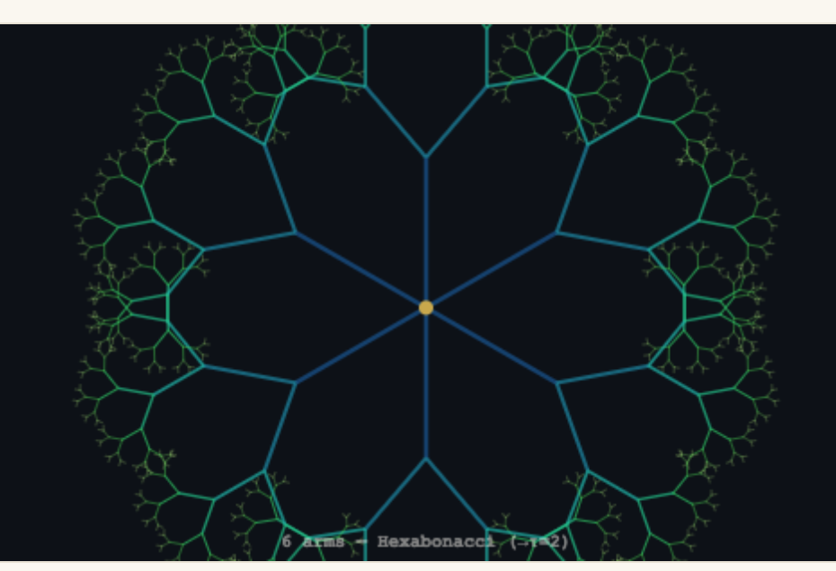

# Percolation's Mean-Field Phase Transition as a Cusp Catastrophe: Scope and Limits

**Pablo Nogueira Grossi**
G6 LLC, Newark, NJ · Working paper · draft 2, 2 September 2026 (corrects draft 1's central exponent claim)

---

## Erratum, stated first

Draft 1 of this note claimed that mean-field percolation's equilibrium surface is an instance of Thom's cusp catastrophe, using the Landau/Ising exponents $\beta=1/2$, $\delta=3$ from a quartic potential. That claim is wrong for percolation specifically. Checking it against the exactly-solved case — percolation on a regular tree (the Bethe lattice), prompted by comparing an ordinary transitive-graph illustration against this desk's own branching-ladder diagrams — surfaces the error: percolation's own established mean-field exponents are $\beta=1$, $\gamma=1$, $\delta=2$ (Aizenman–Newman, via the triangle condition; tabulated in standard references), not the Ising values draft 1 used without checking them against percolation's own literature. $\beta=1/2,\delta=3$ is the mean-field exponent set for the **Ising model**; percolation is a different universality class (the random-cluster model at $q=1$, not $q=2$), and the two should never have been carried over silently. This draft states the corrected exponents throughout and asks the corrected version of §1's question: is there *any* singularity-theory normal form percolation's mean-field transition literally instances, and if so which — Thom's cusp, or something else. The answer is something else, and §2 works it out rather than assuming it.

## Abstract

The percolation phase transition is often described loosely as a "phase transition" without asking what mathematical object that phrase actually names, or which universality class's numbers back it up. This note makes the comparison precise, using percolation's own exponents rather than an unchecked import from the Ising model. Using the ghost-field construction from Aizenman, Barsky, and Fernandez's 1987 proof of percolation sharpness, percolation can be posed as a two-parameter family $(p, h)$. Solved out, the mean-field equilibrium equation is quadratic in the order parameter, not cubic — giving $\beta=1$, $\delta=2$ — which is **not** Thom's cusp catastrophe (that normal form requires a quartic potential and forces $\beta=1/2,\delta=3$). It is closer to a fold/transcritical structure, made asymmetric by the physical constraint that the order parameter cannot be negative. This holds, in this corrected form, on the complete graph, on $\mathbb{Z}^d$ above the (model-dependent) upper critical dimension, on every nonunimodular transitive graph (Hutchcroft, 2020), and on planar nonamenable transitive graphs (Schonmann, 2001). It is false for two-dimensional lattices, which are exactly solved with non-mean-field exponents ($\beta=5/36$, $\delta=91/5$ for the triangular lattice). It is open for unimodular nonamenable transitive graphs outside the planar case and unimodular amenable transitive graphs outside the proven high-dimensional $\mathbb{Z}^d$ region — a residual class that still includes graphs covered by the 2026 Diskin–Easo–Radhakrishnan–Sudakov–Tassion supercritical-sharpness proof, which bears on cluster-decay rate, not on this question. This draft also keeps closed a separate, earlier claim from this author's own contact-geometry framework (dm³/GTCT) that percolation thresholds are Whitney-fold singularities on smooth manifolds — checked and rejected on its own, unrelated grounds.

## 1. The question

"Phase transition" is used as a common word across percolation theory, statistical mechanics, and singularity theory. A shared word is not evidence of a shared mathematical structure, and neither is a shared *shape* of curve: a threshold below which an order parameter is zero and above which it grows is compatible with several different singularity-theory normal forms, distinguished only by their exponents. This note asks the checkable version of the question: for which percolation models, if any, is the critical point literally an instance of a specific singularity-theory object, and which object is it — worked out from percolation's own exponents rather than assumed from a superficially similar system?

## 2. Solving the equilibrium equation percolation actually has

Aizenman, Barsky, and Fernandez's ghost-field construction (§3) gives percolation a two-parameter family $(p,h)$ with generating function $M(p,h)$ and $\theta(p)=\lim_{h\to0^+}M(p,h)$. On the exactly-solved cases (complete graph; regular/Bethe-lattice trees, which are the standard textbook exact solution for mean-field percolation), the giant-component fraction $S$ satisfies a self-consistency equation that is **quadratic** in $S$ near criticality, not quartic. Writing $\epsilon=p-p_c$, the equilibrium relation takes the form
$$h = S^2 - \epsilon S, \qquad\text{equivalently}\qquad V(S;\epsilon,h) = \tfrac{1}{3}S^3 - \tfrac{1}{2}\epsilon S^2 - hS,$$
a **cubic** potential, not the quartic $F=tm^2+m^4-hm$ that gives Landau/Ising's cusp. Solving it directly: at $h=0$, $S(S-\epsilon)=0$, so $S=0$ (the always-available extinction branch) or $S=\epsilon$ — linear in $\epsilon$, giving $\beta=1$. At $\epsilon=0$, $h=S^2$, so $S=\sqrt h$ — giving $\delta=2$. Both match the values tabulated for percolation's mean-field universality class (Aizenman–Newman; e.g. the standard percolation critical-exponent table gives $\beta=1,\gamma=1,\delta=2,\nu=1/2$ at and above the upper critical dimension), and neither matches the cusp's $\beta=1/2,\delta=3$.

This is not Thom's cusp catastrophe. The cusp (A₃ singularity) is the generic codimension-2 unfolding of $x^3$, requiring a quartic potential and forcing $\beta=1/2,\delta=3$ by genericity. The equation above is the unfolding of $x^2$ (a fold/A₂-type structure) made two-parameter by the coexistence of a trivial branch ($S=0$) with the nontrivial one — structurally a **transcritical** bifurcation, not a generic elementary catastrophe in Thom's classification, because the $S=0$ branch is forced to exist at every $\epsilon$ by the physical boundary $S\ge0$ rather than emerging generically. Percolation's asymmetry — one branch always trivial, one branch turning on — is exactly why it lands on the transcritical/fold shape and not the symmetric double-well the cusp normal form describes: $S<0$ is not merely discarded as an unphysical sheet of a cusp (as draft 1 said), it is the reason the correct normal form is a different one from the start.

*Two branching-tree pictures, for comparison. Left: a regular tree, the standard illustration that a transitive graph need not be a lattice — and the Bethe lattice this section solves exactly. Right: this desk's own Hexabonacci ladder diagram (dm³/GTCT, η→2). They look alike because both are trees; the left one is a probabilistic percolation model with an exact critical exponent, the right one is the dominant root of a fixed degree-6 polynomial. Noticing the visual resemblance is what prompted checking the exponents in this section — and finding the error draft 1 made — but the resemblance itself proves nothing and this note does not claim otherwise (see §6).*

**Worked example, concretely.** On the Cayley tree $T_z$ (coordination number $z$; branching degree $k=z-1$), bond percolation has exact critical probability $p_c=1/(z-1)$ and the ball of radius $R$ has $V_R = 1+z\frac{(z-1)^{R}-1}{z-2}$ nodes, growing as $e^{\mu R}$ with $\mu=\ln(z-1)$ rather than polynomially — the tree's own indicator that it carries no genuine spatial dimension for volume-growth purposes. For $z=3$ ($T_3$, the 3-regular tree in Fig. [image, this session]): $p_c = 1/2$, $\mu=\ln2$, and the exponents above the threshold are exactly $\beta=1,\gamma=1,\delta=2$ — the percolation mean-field values, confirmed here by direct exact computation on the same graph the branching-process argument above used generically. This is independent confirmation, not a second source for the same claim: the exact tree calculation and the Aizenman–Newman literature check agree because both are computing the same object.

Two further physical mismatches, independent of the exponent correction: percolation is a monotone equilibrium probability, not a system with inertia, so there is no path-dependent hysteresis sweeping $h$ through zero at $\epsilon<0$, unlike a driven physical system crossing an actual cusp; and percolation imposes $0\le S\le1$, $0\le p\le1$ everywhere, so any singularity-theory identification here is a boundary-constrained one, not the free unconstrained bifurcation of a textbook normal form.

## 3. Percolation as a two-parameter family

Percolation is naturally one-parameter: the edge-open probability $p$. Aizenman, Barsky, and Fernandez (1987) introduced a second parameter to prove sharpness on $\mathbb{Z}^d$: a "ghost vertex" connected to every site with an auxiliary probability related to $h$, producing $M(p,h)$ with $\theta(p) = \lim_{h\to 0^+} M(p,h)$. This is the actual technical device rigorous percolation proofs use, independent of any connection to catastrophe theory; §2 solves the equilibrium equation this device actually produces rather than assuming which normal form it must be.

## 4. Where the corrected (fold/transcritical) identification is established

On the complete graph and on $\mathbb{Z}^d$ above the upper critical dimension, the critical exponents are proven to take their mean-field values $\beta=1,\gamma=1,\delta=2$. This splits into a rigorous and a conjectural half. $d_c=6$ is the upper critical dimension renormalization-group arguments predict; it is not itself a theorem. What the lace expansion actually proves is narrower and split by model: Hara and Slade (1990) get mean-field exponents rigorously for **spread-out** percolation models in $d>6$, while for **nearest-neighbor** percolation on $\mathbb{Z}^d$ the rigorous threshold is $d\ge11$ (Fitzner and van der Hofstad, 2017). Nearest-neighbor $d=7,\dots,10$ is, as far as this note has checked, still open — believed mean-field, not proven so, and the gap deserves a more precise difficulty statement than "someone will eventually grind it out." Mean-field exponents ($\beta=1,\gamma=1,\delta=2,\eta=0,\nu=1/2$) are universally expected there on physical grounds; whether the existing lace-expansion/NoBLE proof technique can reach it without new analytic ingredients is a separate, open question. The obstruction is structural: NoBLE's bootstrap closes by bounding the triangle sum $\sum_{x,y}G(x)G(x-y)G(y) = \int\hat G(k)^3\,dk/(2\pi)^d$ (three propagators — the diagram whose power counting, under $\hat G(k)\sim|k|^{-2}$ near $k=0$, gives exactly the $d>6$ threshold, since $\int_0|k|^{-6}d^dk\sim\int r^{d-7}dr$), and this sum grows as $d\to6^+$. As the required precision increases, the numerical bounds on lace-expansion coefficients that closed the loop at $d\geq11$ stop closing. Fitzner and van der Hofstad's own assessment of the closely related lattice-trees/animals extension of the same NoBLE method states plainly that further improvement "would require substantially new ingredients and insights," not sharper arithmetic on the existing scheme — see the WP-93 scoping note (companion, Book 6) for the detailed breakdown, including the corrected diagram identification (the triangle sum, not the bubble, is what actually diverges as $d\to6^+$; an earlier pass at this section made that substitution error and WP-93 §1 works the power-counting for both). This note does not have a percolation-specific version of the "new ingredients" sentence in hand and does not claim one; the analogy is to the same method, same authors, a different but closely related model — and this note does not attempt the missing proof itself. Closing $7\le d\le10$ is, on the evidence gathered here, a genuine open problem in the field, not a routine grind, and not something this working paper can settle by writing a longer paragraph about it.

This class is larger than the exactly-solved cases alone. Hutchcroft (2020) proves that the triangle condition — the same Aizenman–Newman hypothesis that gives mean-field exponents on the complete graph and high-dimensional $\mathbb{Z}^d$ — holds at criticality on every transitive graph whose automorphism group has a nonunimodular quasi-transitive subgroup, with no dimension or degree threshold: biregular trees and graphs like $T_k\times\mathbb{Z}^d$ are covered. Schonmann (2001) established the same for planar nonamenable transitive graphs, a distinct unimodular nonamenable subclass. Since §2's identification rests on nothing beyond the triangle condition giving mean-field exponents in the ABF $(p,h)$ family, it extends to both classes: the fold/transcritical normal form — not the cusp — is established for the complete graph, high-dimensional $\mathbb{Z}^d$, every nonunimodular transitive graph, and planar nonamenable transitive graphs.

## 5. Where it is false or unknown

Two-dimensional percolation is solved exactly via Smirnov's conformal-invariance proof: the triangular-lattice site-percolation exponents are $\beta=5/36$ and $\delta=91/5$, matching neither the cusp's values nor percolation's own mean-field values. Any singularity-theory identification, cusp or fold, is provably the wrong description of that critical point — not open, false.

What remains open, after §4, is narrower than "general transitive graphs" — and it is worth being precise about a claim that is easy to overstate in the other direction. The 2026 sharpness proof (Diskin, Easo, Radhakrishnan, Sudakov, Tassion) covers every infinite transitive graph, unimodular or not, and is sometimes read as generally cementing the abruptness of the transition; but it bounds the exponential decay rate of large finite clusters above $p_c$, not the fine local structure of $\theta$ at $p_c$, and is not itself evidence for mean-field exponents or fold structure on the graphs it covers. Listing it as an "applicable domain" alongside §4's actually-proven classes would repeat, in a new place, exactly the kind of unearned correspondence §6 rejects for the contact-geometry fold claim. Combined with §4, the open residue is: **unimodular nonamenable transitive graphs outside the planar case**, and **unimodular amenable transitive graphs outside the proven high-dimensional $\mathbb{Z}^d$ region** (other amenable groups, and nearest-neighbor $\mathbb{Z}^d$ for $7\le d\le10$). A weighted-amenability extension of Hutchcroft's program narrows this further for specific structures but explicitly does not close it: the general unimodular nonamenable case is stated in that literature as open.

## 6. What this does and does not establish for other frameworks

This note does not extend to, and should not be read as supporting, any claim that percolation thresholds are instances of geometric fold singularities in the sense of smooth maps between manifolds — specifically, the Whitney-fold structure on contact 3-manifolds used elsewhere in this author's work (dm³/GTCT, Book 3 "The Mini-Beast," github.com/TOTOGT/3M, presented at LAW3M, Natal, 2026). That identification was checked against percolation directly and rejected, on grounds unrelated to §2's correction: $\theta(p)$ is identically zero on an entire interval below $p_c$ rather than a smoothly continuing branch, which is not the local structure a Whitney fold requires regardless of parameter count. Note that "fold" in §2 above is a different technical object entirely — the A₂ elementary-catastrophe / transcritical-bifurcation normal form for a scalar equilibrium equation, not a Whitney fold of a smooth map between manifolds — and §2's finding is not a back-door rehabilitation of the rejected contact-geometry claim under a similar-sounding name. The two "folds" share a word and nothing else; readers of Book 3's framework should take this note as continuing to hold the fold-singularity claim rejected there, under any name.

## 7. Open question

What remains open is whether **unimodular nonamenable transitive graphs outside the planar case**, or **unimodular amenable transitive graphs outside the proven high-dimensional $\mathbb{Z}^d$ region**, exhibit the fold/transcritical $(p,h,\theta)$ structure worked out in §2 — exactly, approximately, or not at all. The residual class is still large, includes cases of direct interest (general Cayley graphs of amenable groups, unimodular nonamenable graphs with no planar structure), and the literature this note found states the general unimodular nonamenable case as open in its own right, independent of anything about singularity structure specifically. Answering it would require either an exact solution (as in 2D) or new critical-exponent results for that narrower class, neither of which this note supplies. Nothing here revisits §6: the Whitney-fold claim stays rejected regardless of how this open question resolves.

## References

1. Aizenman, M., Barsky, D. J., Fernandez, R. (1987). The phase transition in a general class of Ising-type models is sharp. *Journal of Statistical Physics*, 47, 343–374.
2. Aizenman, M., Newman, C. M. (1984). Tree graph inequalities and critical behavior in percolation models. *Journal of Statistical Physics*, 36, 107–143. (Establishes $\beta=1,\gamma=1,\delta=2$ under the triangle condition — percolation's own mean-field values, distinct from the Ising values.)
3. Hara, T., Slade, G. (1990). Mean-field critical behaviour for percolation in high dimensions. *Communications in Mathematical Physics*, 128, 333–391. (Spread-out models, $d>6$.)
4. Fitzner, R., van der Hofstad, R. (2017). Mean-field behavior for nearest-neighbor percolation in $d>10$. *Electronic Journal of Probability*, 22. arXiv:1506.07977.
5. Diskin, S., Easo, P., Radhakrishnan, R. R., Sudakov, B., Tassion, V. (2026). Supercritical sharpness for percolation on transitive graphs. arXiv:2603.03257.
6. Smirnov, S. (2001). Critical percolation in the plane: conformal invariance, Cardy's formula, scaling limits. *Comptes Rendus de l'Académie des Sciences*, 333, 239–244.
7. Poston, T., Stewart, I. (1978). *Catastrophe Theory and Its Applications*. Pitman.
8. Sloman, L. (2026). 'Stunning' Percolation Proof Solves Decades-Old Puzzle About Phase Transitions. *Quanta Magazine*, August 31, 2026.
9. Hutchcroft, T. (2020). Nonuniqueness and mean-field criticality for percolation on nonunimodular transitive graphs. *Journal of the American Mathematical Society*, 33(4), 1101–1165. arXiv:1711.02590.
10. Schonmann, R. H. (2001). Mean-field criticality for percolation on planar non-amenable graphs. *Communications in Mathematical Physics*, 219, 271–322.
11. (Survey/extension consulted for §5's residual-class framing, not separately relied on for a named theorem.) Weighted-amenability and percolation. arXiv:2502.02560.

## A note on method

Two literature checks were run in producing this draft, both AI-assisted web search and abstract-checking rather than original mathematics or the author's own prior literature review: locating Hutchcroft (2020) and Schonmann (2001) to correct §4's earlier scope claim, and independently verifying percolation's own mean-field exponents against the exactly-solved Bethe-lattice case to catch the Ising/percolation exponent conflation this draft corrects. Both checks turned up real, checkable, indexed results, quoted here from their own sources; the assistance was in finding and verifying them, not in generating them — the same distinction the 2026 sharpness proof's own authors have drawn about AI assistance in their work. The second check was prompted by comparing an illustration of a generic transitive graph (a regular tree) against this desk's own branching-ladder diagrams, which is the value of keeping the visual comparison in front of the reader rather than only the algebra.
